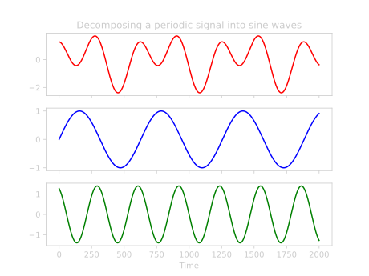
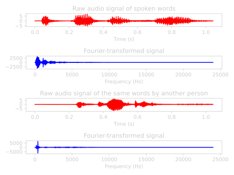

## Fourier Analysis for DS

People going into Data Science as a profession tend to come from a diverse set of technical backgrounds. However, the last few years more and more come from specifically Data Science masters programs. Fourier Analysis is a topic that tends to not be discussed in these settings. I think it's still interesting enough to dive into for a bit, both because of its interesting mathematics and because it can give a lot of insight when working with time-series data.

In this post I will give you a brief overview of what the topic is all about, explain the mathematics behind it and what you can do with it.

## What is Fourier Theory?

Fourier theory busies itself with trying to view everything as waves. The most straightforward setting of this is periodic signals over time. See the figure below for an example. Here you can imagine observing the top signal, and trying to find a set of sine functions such that, when added to eachother, will result in this function.

 \
*Fig: How to get from the top (red) signal to its constituent simple sine waves?*

In this example, the red function can be built by $f(x) = \sin(0.01x) + 1.5\sin(0.02(x+100))$. It is not a priori clear that this is easy or even possible, right? After all, the problem of finding the prime decomposition of a huge number is so difficult that most of our cryptography is based around it. Perhaps the decomposition of a general function into sine waves will be similarly hard?

We lucked out here though for reasons I'll go into later. This decomposition is quite fast to calculate and has resulted in more than a few technological applications over the years. So much so that I'm 100% sure you have used it today without realizing it, unless you are reading this post on paper far from human civilization. (In which case: please reach out to me by mail pigeon because I'm very curious how you heard of it.)

### Why sine waves though
At this point maybe you're thinking: What is the big deal around sine waves anyways? If your head is not still in high school geometry class you're probably not spending most of your day using sin/cos/tan to find triangle side lengths etc.

In a nutshell: they are the simplest form of a periodic function that is smooth, differentiable, integrateable. Their first and second derivatives have some nice properties. Each sine wave has one constant *frequency* (the amount of full periodic movements per second), allowing you to look at functions in terms of their frequencies. This can be very insightful depending on the application. Using sine waves also causes the decomposition process itself to have some nice properties which we can go into later on.

## Fourier Series
Okay so just to spill the beans on how to write a periodic function in terms of sine waves, you do it like this:

$$
s(x) = A_{0} + \sum_{n=1}^{\infty} A_{n} \cos \Big( \frac{2 \pi n x}{P} \Big) + B_{n} \sin \Big( \frac{2 \pi n x}{P} \Big)
$$

Where $A_{n} , B_{n} \in \Reals$ are coefficients, $P$ is the period of the function (the length of the interval that keeps repeating itself) and $s(x)$ is the function.

First question you may have here is why are there cosines here all of a sudden? You were promised sines only and now you feel bamboozled. A quick save can be made by using the identity $\sin \Big( \phi + \frac{\pi}{2} \Big) = \cos ( \phi )$, so we could just substitute the cosines in the above equation by *shifting* the argument and forgetting about it. To see why either of them is needed look at the first example of this post. The top (red) graph has a non-zero value at $t=0$. No amount of multiplying the argument of a sine function can make it non-zero there, so we should allow for shifting the sine function around on the x-axis as well (or equivalently allow for using cosines) to be able to model this function.

Now with the sines and cosines, we additionally allow for *scaling* the x-axis in a specific way. We take the set of sine waves such that it makes $n$ whole periodic movements in the interval of length $P$ (for $n$ starting from 0 all the way up to infinity). This results in the stuff within the sine and cosine function arguments.

This gives us the basic building blocks in terms of which we will describe any periodic signal. The signal is then built from them simply by multiplying each with a coefficient and adding them up.

The second question that remains is: Okay there are these coefficients $A_{n}$ and $B_{n}$, but how do we find them? If it's possible to rebuild a signal in terms of these sine wave building blocks, calculating these seems like the secret sauce and the heart of the matter.

Again I will give you the answer, then try to make it make sense:

$$
A_{0} = \frac{1}{P} \int_{-P/2}^{P/2} s(x) dx \newline

A_{n} = \frac{2}{P} \int_{-P/2}^{P/2} s(x) \cos \Big( \frac{2 \pi n x}{P} \Big) dx \newline

B_{n} = \frac{2}{P} \int_{-P/2}^{P/2} s(x) \sin \Big( \frac{2 \pi n x}{P} \Big) dx
$$

The coefficient $A_{0}$ is simply the average value of the function $s(x)$ in the interval $[-\frac{P}{2}, \frac{P}{2}]$. Taking this coefficient separate essentially substracts it from whatever else we are calculating and allows us to assume that the rest of the function is centered around the x-axis.

The coefficients $A_{n}$ are a bit more esoteric: On this same interval, it essentially looks at the average value of the cosine multiplied with our function $s(x)$. Some more explanation for this will follow later on in this post but for now, convince yourself that the value of $A_{n}$ will be a measure of how much the function values 'agree' with eachother. If both $s(x)$ and the cosine function are highly positive at a certain $x$, this will give a high positive value. Same if they are both negative. But if they tend to disagree (e.g. one is positive and the other negative) it will give a negative contribution to this integral. It is a very similar concept to seeing how much the two functions correlate with eachother on this interval.

For $B_{n}$, exactly the same argument as $A_{n}$ holds, but now just using cosine instead of sine.

The last question that remains before we can play around a bit with them concerns that pesky infinite sum in the main formula. Why do you need an infinite number of terms to get anything done around here?! The answer is that we *mostly* don't. If the function you want to approximate is similar enough to a set of simple waves you need way fewer. In the example at the top we needed just two terms to fully reconstruct the signal (because that's literally [how I constructed that signal](https://github.com/jbukala/jbukala.github.io/blob/main/content/posts/fourier-analysis/fourier_plots.py) in the first place).

### Fun with Fourier approximations

To play around with approximating signals by Fourier series, [check out this applet](https://www.falstad.com/fourier/) while reading the rest of this section. In this applet, we have a number of settings we can play with and study what the resulting Fourier approximation looks like.

The white signal at the top is the function $s(x)$ that we want to approximate. This can be varied by clicking the buttons on the right of the graph ('Sine' until 'Noise'). The red signal overlapping it is our current Fourier approximation. In the bottom-right there is a slider called 'number of terms'. This means: How many sines and cosines do we want to use in our approximation (until which $n$ will we be calculating the summation). The most interesting setting will be to vary this between 1 and about 10 terms, as this is where the most drastic changes to the output will be seen. The bottom two graphs are just plots of all the $A_{n}$ and $B_{n}$ values that are calculated for the approximation.

Now you can see that for the sine or cosine input signals we only need to have one term to have a perfect approximation. The more 'spiky' a signal is (sawtooth, square, or noise at its extreme), the more terms we need to add to make a reasonable approximation. If you select the Square signal and start at 1 term and move up from there, you will see that the approximation never really gets 'good' around the part where the function jumps up or down. The square signal function is just not very 'wave-like' in those places.

To get a feel for how 'good' an approximation is, there is a 'sound'-checkbox as well, which plays your approximation as a sound wave. This way you can listen how much those extra Fourier terms matter to your human ear.

*Side note*: The cosine is an *even* function: $\cos(-x) = \cos (x)$, while the sine is *uneven*: $\sin(-x) = - \sin (x)$. This can sometimes be exploited by picking the area over which you integrate wisely such that the function is even or uneven in that section. If you function is even around $[-P/2, P/2]$ then all $B_{n}$ in its Fourier series will be 0. Same thing for uneven functions and the $A_{n}$ coefficients. In the applet, the square wave function is uneven when you open it. Pressing the phase-shift button a few times makes it an even function. See what happens to the coefficients while you do it.

### Complex notation
I already explained that sine and cosine functions are sort of the same thing, just shifted with respect to eachother. There is a more commonly used way of writing the above Fourier series expansion, using *[Eulers formula](https://en.wikipedia.org/wiki/Euler%27s_formula)*:

$$
e^{i x} = \cos( x ) + i \sin( x )
$$

Where $i$ is the imaginary unit. For understanding more about *why* this formula is true check out the link. We can just use it here to rewrite the equations above and end up with the following:

$$
s(x) = \sum_{n = - \infty}^{\infty} c_{n} e^{\frac{2 \pi i n x}{P}} \newline

c_n = \frac{2}{P} \int_{-P/2}^{P/2} s(x) e^{- \frac{2 \pi i n x}{P}} dx

$$

Note that the formula got a bit more abstract, but also simpler. We now only have one type of coefficient $c_{n}$, and the role of the sine and cosine has been taken over by this complex exponential. This complex exponential is often depicted by a circle in the xy-plane, with the number 1 on the x-axis and the number $i$ on the y-axis. See the figure below for an illustration:

 \
*Fig: A graphical illustration of Eulers formula resulting in the natural use of polar coordinates in the complex plane ([Source](https://commons.wikimedia.org/wiki/File:Euler%27s_formula.svg))*

With this illustration it becomes more natural to talk about a point in terms of polar coordinates: Its *magnitude* (distance from zero) and *phase* (rotation around zero, starting at the positive x-axis). If you go back to the applet we played with you can check the box names 'Mag/Phase View' to look at the Fourier coefficients from this perspective. Keep in mind that the thing we are doing is exactly the same, we have just rewritten it to look at it from another perspective that tends to come in handy.

## The Fourier Transform

Instead of merely taking a function and trying to rebuild the original as much as possible using waves, we can go a bit further: What if the interesting thing about a function is something that you can only observe by looking at it in terms of waves? Think about the sound waves we played with in the applet. Often the most natural way of talking about them is in terms of which *frequencies* are part of it.

This is something that the Fourier *Transform* allows us to do. It takes the x-axis (often the time-axis) and transforms a signal such that it can be viewed on the $\omega$-axis, with $\omega$ being the frequency. We say often that we transform the function from the *time-domain* to the *frequency-domain*. The Fourier transform of a function $f(x)$ can be calculated as follows:

$$
\hat{f}(\xi) = \int_{- \infty}^{\infty} f(x) e^{- i 2 \pi \xi x} dx
$$

As you see its very similar to our series formula, with a few minor differences ([taking the limit](https://en.wikipedia.org/wiki/Fourier_transform#Definition) of $P$ growing to cover the entire real line in the $c_{n}$ formula). Here it doesn't matter anymore if our function is periodic or not, we can transform it all the same. Hence this integral going over the entire real line. Because this function $\hat{f}(\xi)$ is a complex-valued one encoding both the magnitude of the frequencies and their phases, we can get the magnitude of it to find $F( \omega ) = ||\hat{f}(\xi)|| $ if we only want to look at the relative importance of each frequency. (Essentially we throw away all the phase information in that step.)

You can see the results of Fourier-transforming a few simple functions in the figure below.

 \
*Fig: Fourier transforms of some simple functions ([source](https://mriquestions.com/fourier-transform-ft.html))*

You can see that a simple sine wave, being spread out over the entire $t$-axis, only has a single nonzero point when looking at the frequency content. The sinc-function, looking a bit more complicated in the time-domain, is a simple non-zero block in the frequency-domain. A Gaussian function is still a Gaussian afterwards, so it's an *eigenfunction* of the Fourier transform! (Maybe this makes sense to you if you look at the formula of a Gaussian function: you can see how similar to our complex exponential it is. If you are interested, finding Fourier eigenfunctions is another fun mathematical rabbithole.)

To emphasise that this is merely a change of perspective: no information is lost during this transform, meaning that we can also do it the other way around. The way to go back is really similar, called the inverse Fourier transform and looks like this:

$$
f(x) = \int_{- \infty}^{\infty} \hat{f}(\xi) e^{i 2 \pi \xi x} dx
$$

The only thing that changed is the minus sign in the complex exponential of the integral. So now we have a tool to take any signal over time, and look at it from a different perspective. We'll see later on why this perspective pops up in all kinds of applications.

## Applications

So, let's finally get down to the applications. In essence, the Fourier transform pops up anywhere there are waves or recurring patterns, which is a lot of places! 

### Audio
Something we already mentioned (and is the most obvious) is in sound. Sound consists of pressure waves, oftentimes in repeating patterns. We tend to discuss sounds in terms of frequencies (My voice is *higher* than yours, this music has lots of *bass*, etc). The Fourier transform gives us a mechanism to move from the physical phenomenon that a microphone might pick up (air pressure over time) towards something making more sense to us as humans. Even the hair cells in our ears are each tuned to be receptive to their own specific sound frequencies, so the signal going towards our brains is already Fourier-transformed!

You can see an example of Fourier transforming audio in the figure below:

 \
*Fig: A raw audio clip of two people speaking the same words, and their Fourier spectrums underneath it*

In this image, you can see that the Fourier spectra are mostly non-zero near the low frequencies. Because the sampling rate of this audio file is fairly high (48.000 data points per second!) it is possible to encode really high frequencies, that are not really present in spoken language. Looking at these graphs side by side you can also see how this can be useful as a lossless **compression** algorithm. The Fourier signal is quite sparse (consisting of mostly zeroes), so there is no need to save every single datapoint. This is why it's used in the MP3 file-format as well.

This is even more efficient if you also explicitly want to throw out known noise at certain frequencies, like a low-frequency background hum or an annoying high-frequency beep. It's really straightforward in the frequency-domain to overwrite specific frequencies or frequency ranges with 0, and then doing an inverse Fourier transform. This does exactly what you expect and can be a great **noise filtering** system if you know the frequency characteristics of your noise.

 \
*Fig: Example of filtering out (high-frequency) noise using the Fourier transform ([source](https://www.appsloveworld.com/bestanswer/matlab/33/filtering-signal-noise-using-fourier-transforms-and-matlab))* 

The frequency spectrum of speech can be fairly distinctive from person to person, so this can make a good simple **voice recognition** system as well.

### Images

Until so far we have been applying the Fourier transform to a 1D signal. With very little extra steps, we can generalize this to more dimensions. Most of what we have to do is perform our integral over an $n$-D space now, and see our frequency as a vector, with a component for each dimension.

 \
*Fig: an image and its Fourier transform ([source](https://www.projectrhea.org/))*

Armed with this generalization, most of the same uses apply to images as well: Image compression ([interactive demo](https://demonstrations.wolfram.com/ImageCompressionViaTheFourierTransform/)), noise filtering, decent space to start doing some simple image recognition in.

This is why it's used in the JPEG image file format as well.

### Time-series

In time-series data, the Fourier spectrum can help you quickly identify **seasonality** in your dataset: just look for spikes around specific frequencies, to see how much your signal varies daily, weekly, yearly, etc. Some time-series libraries, like the [FB Prophet](https://facebook.github.io/prophet/) library, will also use Fourier coefficients to build features from under the hood.

Sensor data is also used a lot in the field of **predictive maintenance**. Oftentimes before physical components of systems fail, they will exhibit a higher-frequency vibration. This is something that can be more clearly seen as a sudden spike in the high-frequency part of the spectrum of a movement-sensor.

 \
*Fig: Example predictive maintenance use-case using spectral analysis ([source](https://www.embedded.com/open-source-kit-supports-predictive-maintenance/))*

In general for **Data Science**, the relative strength of the signal within certain frequency bands can be great features to put into your Machine Learning model. They are quick to make, mostly quite interpretable in a business context and powerful predictors.

### Others

For NLP: The **positional encoding** scheme used in Transformer models can also be more [readily understood](https://towardsdatascience.com/master-positional-encoding-part-i-63c05d90a0c3) in the context of Fourier theory.

In the field of **digital signal processing**, [filters](https://en.wikipedia.org/wiki/Digital_filter) can be designed to have a very specific effect, dampening or amplifying it depending on frequency.

The multiplication of very large numbers can be [done more efficiently](http://numbers.computation.free.fr/Constants/Algorithms/fft.html) with the Fourier Transform.

## Discrete and Fast Fourier Transforms

So far, all of the formulas that we've been using have been for continuous functions $s(x)$. However, a lot of real-life scenario's discussed here instead have *discrete* signals. This means that there is (usually a constant) time between measurements of your signal. e.g. the audio file we discussed had 48.000 measurements per second, so 1/48.000 seconds in between each measurement.

### Discrete Fourier Transform (DFT)
Once again we are lucky in that this doesn't change much for us: We take the formula for $c_n$ replace integrals with sums and discretize the values in the complex exponential. Assuming a signal with $N$ measurements $\lbrace x_{n} \rbrace = \lbrace x_{0}, x_{1}, ..., x_{N-1} \rbrace$, its Discrete Fourier transform $\lbrace X_{n} \rbrace$ is calculated as:

$$
X_{k} = \sum_{n=0}^{N-1} = x_{n} \cdot e^{-i 2 \pi\frac{k}{N}n}
$$

In this discrete setting there's something else we should take into account: Our ability to measure high frequency signals is limited by the amount of measurements we make per second (the *sampling frequency*). If I only ever measure the temperature on Jan 1st every year, there is no way for me to know that it varies in a yearly pattern, or even throughout the day. The fact that you need to have a sampling frequency at least twice the highest frequency you want to represent is known as the [Shannon-Nyquist theorem](https://en.wikipedia.org/wiki/Nyquist%E2%80%93Shannon_sampling_theorem).

### Fast Fourier Transform

The [Fast Fourier Transform](https://en.wikipedia.org/wiki/Fast_Fourier_transform) or FFT for short, is something that takes the definition of the Discrete Fourier transform but uses a much more efficient algorithm to compute it. For a signal with length $n$, the computational complexity of the naive DFT is $\mathcal{O}(n^2)$, which the FFT takes down to $\mathcal{O}(n \log n)$. This has been a game changer, especially when it was invented for general-length signals in 1965. 

## Mathematical Intuition

*This section can be safely skipped if you are just not that into linear algebra.*

We now have the formulas to start using it, but for those who are wondering how we got to them or why they work in the first place, this section attempts to give some intuition on the idea behind it.

The general train of thought is as follows:
* Vector spaces have a *basis*, from which you can make any element in that space by scalar multiplication and vector addition of the elements in the basis
* If the vectors are orthogonal (their *inner product* is 0) and normalized (they have length 1) they are called *orthonormal*. This is a nice property for a basis to have.
* The space of functions is also a vector space. You can check all [the requirements](https://en.wikipedia.org/wiki/Vector_space#Definition_and_basic_properties) yourself, but it's easy to see that it is closed under addition of its elements as well as scalar multiplication when you define them in the most straightforward way:
$$
(f + g)(x) = f(x) + g(x) \newline
(\lambda \cdot f)(x) = \lambda \cdot f(x)
$$
* This means that functions defined on an interval $[a,b]$ are vectors as well, and that they form an (infinite-dimensional) vector space
* In this space you can also define an [inner product](https://en.wikipedia.org/wiki/Inner_product_space#Definition) as follows:
$$
\langle f, g \rangle = \int_{- \infty}^{\infty} f(x)g(x) dx
$$
* Armed with this inner product, you can calculate that $\langle sin(\frac{2 \pi x n_i}{b-a}) , sin(\frac{2 \pi x n_j}{b-a}) \rangle = 0 \quad \forall \quad n_{i}, n_{j} \in \Z$ if $n_{i} \neq n_{j}$. In other words, all these different sine waves are *orthogonal*. And depending on the domain they can also be normalized by putting a normalization factor in front. So we can create an *orthonormal* set of functions.
* By using the sets of sines and cosines together, or alternatively the complex exponential form, it forms a *basis* for this space of functions. (No proof for that in this post though)
* Looking at it from this perspective, the Fourier transform is nothing more than a basis transformation on the space of functions!
* If you scroll up to the definitions, you see that calculation of the coefficients $A_{n}$, $B_{n}$ or $C_{n}$ is just calculating the inner product between our function and each of our basis vectors. We then use these coefficients as scalar factors of each basis vector, just like any basis transformation in linear algebra.

Hopefully this train of thought makes it make more sense. It can also provoke further questions like what's so special about this set of functions that makes them able to form an orthonormal basis? Turns out they are not even *that* special. You can take different sets of functions to [generalize this concept](https://en.wikipedia.org/wiki/Generalized_Fourier_series):
* [Chebyshev polynomials](https://en.wikipedia.org/wiki/Chebyshev_polynomials)
* [Legendre polynomials](https://en.wikipedia.org/wiki/Legendre_polynomials)
* [Bessel functions](https://en.wikipedia.org/wiki/Fourier%E2%80%93Bessel_series)
* Wavelets (see below)
* Something else tailored to your data

Which one of these is appropriate to write your function in really depends on the kinds of functions you're modeling. We already saw that for the Fourier series the square wave wasn't approximated so well near its jumps, and each choice here will have some pros and cons.

## Conclusion

* Fourier theory can help you look at time signals in their *natural* domain
* The Fourier transformation is nothing more than a basis transformation (using a basis of waves) on the space of functions
* Knowing Fourier transformations is a gateway to learning about the signal processing and representation field and more
* As a Data Scientist, frequency space can be a great place to start generating informative and interpretable features for your ML models
* You use its results all day every day in your technology

## Follow-ups / Continue Reading

Some other topics that may be of interest after reading this post:
### Convolution Theorem
The mathematical operation of [convolution](https://en.wikipedia.org/wiki/Convolution) of two signals is used in many fields to calculate statistical expectations, convolve signals with filters, convolutional neural networks, etc. The [convolution theorem](https://en.wikipedia.org/wiki/Convolution_theorem) states that performing the convolution operation in the Frequency domain comes down to performing a simple pointwise multiplication, instead of a complicated integral. This fact is exploited in most practical implementations of convolution: The signals are both Fourier-transformed, quickly multiplied with eachother, and the result then inverse-Fourier transformed.
### Laplace Transform
The [Laplace transform](https://en.wikipedia.org/wiki/Laplace_transform) can be seen as a generalization of the Fourier transform and is defined by: $\mathcal{L} \lbrace f \rbrace (s) = \int_{0}^{\infty} f(x) e^{-st} dt$. Here $s \in \Complex$ is a complex number. If we look at the special case where its purely imaginary: ($s=2 \pi i \xi$) and take the integral over the entire real line (matter of convention) we get the Fourier transform back. This transform also turns convolutions into simple multiplications, but as an added benefit turns [differential equations into algebraic equations](https://en.wikipedia.org/wiki/Laplace_transform_applied_to_differential_equations) by turning differentiation into multiplication and integration into division by $s$. Hence it's an important part of the engineering toolbox.
### Short-time Fourier transform
Usually when you do a Fourier transform, you transform the entire signal. This gives you the widest range of frequencies that you can model, but has as a disadvantage that you have no insight into how the frequency content changes over time. A simple way to start fixing this problem is by just chopping the input signal into segments, and then Fourier transforming each segment separately. You can now track the frequency content over time, even though you may lose some resolution at the low end of the spectrum. This is called the [Short-time Fourier transform](https://en.wikipedia.org/wiki/Short-time_Fourier_transform).
### Wavelets 
A family of functions that are created from one *mother* function by translating and scaling it in a certain way. An advantage of the [wavelet](https://en.wikipedia.org/wiki/Wavelet) transform is localization, as they have only a small area where they are non-zero. This set of functions can then be used similar to the sine waves in a *wavelet transformation*. They are used in more recent image formats like JPEG2000.
### Uncertainty principle/Gabor Limit
When I showed some examples of simple functions and their Fourier transforms, remember that the sine function is spread out over the entire x-axis, while the fourier transform of it is just a peak at exactly one frequency, so it's very localized in the frequency spectrum. The converse is also true: A unit pulse (a signal only being nonzero at exactly one point) has an infinitely wide spread in the frequency spectrum. It turns out that something like this holds more generally: If something is very localized in one domain, it must be very spread out in the other one. The amount of spread in both can be quantified by calculating their standard deviation, and is at least equal to the so-called *Gabor-limit*: 
$$ 
\sigma_{x}^{2} \sigma_{ \xi }^{2} =  \big( \int_{- \infty}^{\infty} x^2 | f(x) |^{2} dx \big) \big( \int_{-\infty}^{\infty} \xi^2 | \hat{f} ( \xi ) |^{2} d \xi \big) \geq \frac{|| f ||_{2}^{4}}{16 \pi^2}
$$
The equality is achieved when both $f$ and $\hat{f}$ are Gaussians. One application of this is in quantum mechanics: The wavefunction describing the position of a particle and the one describing the momentum are Fourier transforms of eachother. A special case of the Gabor limit is then that position and momentum cannot be known at the same time to an arbitrary amount of precision, but that $\sigma_{x} \sigma_{p} \geq \frac{\hbar}{2}$. This is known as the [uncertainty principle](https://en.wikipedia.org/wiki/Uncertainty_principle).

Further Reading:
* [More step by step visuals with long-form explanation](https://devincody.github.io/Blog/post/an_intuitive_interpretation_of_the_fourier_transform/) on the mathematical intuition behind the Fourier transform
* Proof of the uncertainty principle [using Fourier analysis](https://en.wikipedia.org/wiki/Uncertainty_principle#Wave_mechanics_interpretation) (also called Kennard inequality)
* [Digital filter](https://en.wikipedia.org/wiki/Digital_filter) design
* Explanation of the most common FFT algorithm, the [Cooley-Tukey algorithm](https://en.wikipedia.org/wiki/Cooley%E2%80%93Tukey_FFT_algorithm)
