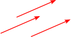
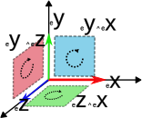
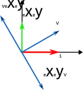

## Vector Product Aesthetics

### The Beauty: Inner Product
Think back for a minute to your first Linear Algebra course: Remember how nice inner products were to compute? Try to think of how to do it off the top of your head. If it's a bit blurry: it's just taking each component of the vectors, multiplying them and adding all the results: 
$$\mathbf{a \cdot b} = \sum_{i=0}^{N} a_i b_i$$ 
Calculating it gives you a scalar that says something about the angle between the two. It is as simple to do in 687D as it is in 2D. 

### The Beast: Cross Product
Now consider cross products in contrast. Do you still remember? *Yeah, neither do I*. Something about each component being multiplied together with the other ones in 2 different ways, and then subtracting the 2 results from eachother. Oh right, and then it only exists in 3 dimensions (And actually also in 7 dimensions, *what, how*)?! Wikipedia says the formula is:
$$
\mathbf{a \times b} = 
\begin{bmatrix}
           a_{2}b_{3} - a_{3}b_{2} \newline
           a_{3}b_{1} - a_{1}b_{3} \newline
           a_{1}b_{2} - a_{2}b_{1} \newline
         \end{bmatrix}
$$
Now what does the output mean: you get a vector orthogonal to your 2 original ones, with a magnitude equal to the surface that is spanned by the paralellogram of the 2 vectors. How does a vector *length* equal some surface *area* in the same space? The units don't even work. It's clear that something is off.

### A Way Out
When you inevitably bring it up it's often encouraged not to worry too much about it, it's just some math stuff, shut up and learn the formula by heart. For those people plagued for years by these questions, today I present salvation from your vector-related nightmares: **Geometric Algebra**.

Geometric Algebra (known in some circles as a *Clifford algebra*) is a simple and small step back from Linear Algebra in terms of abstractness. In turn, it gives you a nice and consistent framework where many things just suddenly make *sense*: Cross products, imaginary numbers, quaternions and more.

## Multiplying Vectors
To kick this journey off think about what we can do with vectors in general: we can add them together, we can multiply them with scalars, but we don't know how to multiply them with eachother. This multiplication takes place in a space that is a bit more general then just a vector space, encompassing so-called $n$-vectors.

### n-Vectors
Lets first discuss what objects are living in this space. To give an idea about how you can visualize them, we'll need some pictures (how can you do *geometric* algebra without some pictures after all).

The objects we are interested in are on the same ladder as *scalars* and *vectors* are, we are just adding some extra rungs. Again, think about your first Linear Algebra course: You had *scalars*, which are just numbers with a *magnitude*. This is then contrasted by *vectors*, which can be visualized as an arrow, which now not only has a magnitude (which is the arrow's length) but a direction as well (where it is pointing). Note that it doesn't matter where exactly you draw this vector, arrows with the same direction and length are seen to be *equivalent*. 

\
*Fig: Three equivalent vectors*

This step from a 0D point to a 1D line practically begs us to keep going: But what would the equivalent 2D object look like? The answer is that a 1D line segment becomes a 2D surface/sheet, and the magnitude of this sheet is its *area*. Note that our 1D arrows were pointing a certain way, and thus our sheet should do the same, ergo it's a 2D *oriented* flat surface (essentially this means we can assign a top and bottom side to it). We call this object the **bi-vector**. Our 'normal' 1D vectors can then be called a **mono-vector** or **1-vector** to avoid confusion.

\
*Fig: Two vectors u and v on the left and a bi-vector called* $u \wedge v$ *on the right* ([source](https://commons.wikimedia.org/wiki/File:Prod2.png))

Much like the 1-vector scenario, it doesnt matter much where you place this object. To go even further: as long as its magnitude (*area*) stays the same and the surfaces' top points to the same direction, you can even transform the surface however you like. But flipping the direction of the surface corresponds to flipping the sign of the bi-vector:

\
*Fig: Two bi-vectors with opposite orientation* ([source](https://commons.wikimedia.org/wiki/File:Alternating1.png))

We can do the same things with it as we are used to with 1-vectors: multiplying with a scalar just scales the surface by that amount. We can add two 1-vectors $v_1$ and $v_2$ by aligning the end of $v_1$ with the start of $v_2$, and drawing a new straight line from the start of $v_1$ to the end of $v_2$:

\
*Fig: Adding 1-vectors* ([source](https://commons.wikimedia.org/wiki/File:1vectoraddition.png))

Similarly, we can also align a side of each bi-vector, and draw a new bi-vector from start to end to get the sum of two bi-vectors:

\
*Fig: Adding bi-vectors* ([source](https://commons.wikimedia.org/wiki/File:2vectoraddition.png))

Exactly like having a orthonormal basis $ \lbrace e_i \rbrace $ of a 1-vector space from which you can make any 1-vector through addition and scalar multiplication, you can take a set of mutually orthonormal surface areas $ \lbrace \Pi_i \rbrace $ and use that as a basis of bi-vectors. 

Hopefully after seeing these things in action, you are convinced that bi-vectors are consistent objects, we can work with them like 1-vectors and the results of that make sense. Of course bi-vectors are also not the end of this ladder we are climbing. We have a general recipe to do this for any dimension (it's just that the drawings will get less, uhm, informative). As a last example, 1 rung higher on the ladder we will get an oriented (has an inside and outside) 3D volume, called a **tri-vector**:

\
*Fig:* $n$*-vectors for* $n=0..3$ ([source](https://commons.wikimedia.org/wiki/File:Grassmannian.png))

### Interactions between n-Vectors
So far all the mono, bi, tri, $n$-vectors have lived happily in their own world. While a neat continuation of a train of thought, defining them hasn't really added anything to our understanding yet. The key to their usefulness comes in when we revisit the cross product, but do it *the proper way*.

### Cross-product revisited
Remember that the inner product gave us some information on how much two vectors overlap, helping you measure the angle between them, or projecting one onto the other. The issue is that this inner product gives a limited amount of information on the original vectors. In 3D space, if you know a vector $\mathbf{a}$, an inner product $\mathbf{a \cdot b} \in \reals$, and you are interested in identifying $\mathbf{b}$, there is a whole plane orthogonal to $\mathbf{a}$ in which $\mathbf{b}$ could lie, and this lack of info about the original vector $\mathbf{b}$ gets even worse in higher dimensions.

In 3D the cross-product actually gives us enough information (if we combine it with the inner product) to reconstruct the original vectors. So: can we make something similar to the cross-product in 3D, but *better*? Spoiler: yes we can.

Let us define the *wedge product* $\mathbf{a} \wedge \mathbf{b}$. The cross-product gives the area of the space that is spanned between the two input 1-vectors, and it points in a direction orthogonal to them. These are nice things, let's keep them. The difference is that our wedge product will actually output a bi-vector. It will be the bi-vector with its surface's top pointing orthogonally to the input vectors, and a magnitude equal to the area spanned by the paralellogram of the two vectors. The surface will either point up or down depending on which vector is first, such that $\mathbf{a} \wedge \mathbf{b} = -\mathbf{b} \wedge \mathbf{a}$ (a.k.a. it is *anti-commutative*).

\
*Fig: The difference between* $\mathbf{a} \times \mathbf{b}$ *and* $\mathbf{a} \wedge \mathbf{b}$ *in 3D space* ([source](https://commons.wikimedia.org/wiki/File:Exterior_calc_cross_product.svg))

We started out with two 1-vectors and ended up with a bi-vector. In this way the wedge product has brought us *up* on the ladder of $n$-vectors. If we wanted to, we could take the wedge product between this bi-vector and another 1-vector to make a tri-vector. We start to see how the different levels of $n$-vectors begin to interact.

There is something neat to note here about the basis elements of our bi-vector space. Now that we have the wedge product we can actually represent the basis *bi*vectors by wedge products of basis 1-vectors. If $ \lbrace e_i \rbrace $ is the basis of the 1-vector space, we can build a basis-surface pointing in the $i$-direction for the bi-vector space $A_i$ by wedging: 
$$
\lbrace A_i = e_j \wedge e_k \quad \forall i,j,k \quad | \quad i \neq j, \quad j \lt k \rbrace
$$

Which means we just need the basis of the 1-vectors, combined with the wedge product in order to fully describe all $n$-vectors.

\
*Fig: Showing (in 3D) how the vector base can be used with the wedge product to create a bi-vector base*

## Defining the geometric product
Now we can finally make a nice workable definition of a geometric product between vectors:
$$
\mathbf{ab} \equiv \mathbf{a} \cdot \mathbf{b} + \mathbf{a} \wedge \mathbf{b}
$$
In this way we combine all the information of both the inner product as well as our wedge product.
Another equivalent way of thinking about it is that $\mathbf{ab}$ is the *linear transformation* that brings $\mathbf{a}$ to $\mathbf{b}$:
$$
\mathbf{a(ab) = b}
$$

### First Observations
Firstly, you can note that the inner product outputs a scalar and the wedge product an $n$-vector. How can we add them? In reality, we don't actually need to, just like representing complex numbers $z = a + bi$ without knowing how to add $a \in \reals$ to $bi \in \Im$. In general the objects in our space are sums of $n$-vectors for different values of $n$. The term we use for these objects is **multi-vectors**.

Let's look at what happens with the geometric product in some simple settings. If $\mathbf{a}$ and $\mathbf{b}$ are parallel, the area spanned by them will be 0, making the wedge product 0 and thus the geometric product reduces to a simple inner product. If they are orthogonal however, it will be the inner product that equals zero and only the wedge will remain.

Let's take this one step further. We already know we can build a basis of higher order $n$-vectors from wedge products of basis 1-vectors. Assuming our basis is orthonormal the geometric product and wedge product are the same, so for the basis of our bi-vector space we can just write $ \lbrace \mathbf{e_{i}e_{j}}| i\neq j\rbrace $

We can also note down the following **rules** for working with the geometric product for basis vectors in this space:
1. $\mathbf{e_{i}e_{i}} = ||\mathbf{e_i}||^2 = 1 \quad \forall i$ (because it's parallel with itself)
2. $\mathbf{e_{i}e_{j}} = -\mathbf{e_{j}e_{i}} \quad \forall i \neq j$ (because the wedge product is anti-commutative)

## Consequences
The previous observations now allow us to simplify this multi-vector space: we can write everything in terms of the 1-vector basis and the geometric product. This will have some unexpected benefits.

### Example in 3D
Let's say we now want to calculate the geometric product of two vectors in 3D. We write the vectors in terms of their components and simply start multiplying out the terms:
$$
(a_{1}\mathbf{\hat{x}} + a_{2}\mathbf{\hat{y}} + a_{3}\mathbf{\hat{z}})(b_{1}\mathbf{\hat{x}} + b_{2}\mathbf{\hat{y}} + b_{3}\mathbf{\hat{z}}) = \newline
a_{1}b_{1} \mathbf{\hat{x}\hat{x}} +
a_{1}b_{2} \mathbf{\hat{x}\hat{y}} +
a_{1}b_{3} \mathbf{\hat{x}\hat{z}} + \newline
a_{2}b_{1} \mathbf{\hat{y}\hat{x}} +
a_{2}b_{2} \mathbf{\hat{y}\hat{y}} +
a_{2}b_{3} \mathbf{\hat{y}\hat{z}} + \newline
a_{3}b_{1} \mathbf{\hat{z}\hat{x}} +
a_{3}b_{2} \mathbf{\hat{z}\hat{y}} +
a_{3}b_{3} \mathbf{\hat{z}\hat{z}}
$$
If we now use our **rule 1** that says $\mathbf{\hat{x}\hat{x}} = \mathbf{\hat{y}\hat{y}} = \mathbf{\hat{z}\hat{z}} = 1$, and **rule 2** saying that $\mathbf{\hat{x}\hat{y}} = - \mathbf{\hat{y}\hat{x}}$ etc. We then end up with the general formula of the geometric product of two vectors in 3D:
$$
\mathbf{ab}  = a_{1}b_{1} +a_{2}b_{2} + a_{3}b_{3} + \newline
(a_{1}b_{2} - a_{2}b_{1})\mathbf{\hat{x}\hat{y}} + \newline
(a_{2}b_{3} - a_{3}b_{2})\mathbf{\hat{y}\hat{z}} + \newline
(a_{1}b_{3} - a_{3}b_{1})\mathbf{\hat{x}\hat{z}}
$$

Looking at this formula 2 things are clear:
1. All the scalar stuff on the first line is simply the dot product.
2. The formula for the bi-vector terms looks very familiar: It is exactly the formula for the cross-product! Only now, the output is not a 1-vector but a bi-vector. (This gets rid of the weird explanation around the magnitude of the cross product vector being equal to the surface spanned of the input vector that we  started this post out with.) 

Great, so now we have at least something that simplifies to the cross-product when we calculate in 3D, while still being conceptually consistent: We saved the cross-product!

## Outcomes
But this is where the pay-off is just starting.

### Imaginary numbers
Let's look at the following setting now: We are in 2D space, and concerned with multivectors of the following form:
$$
\mathbf{a} = a_{1} + a_{2} \hat{x}\hat{y}
$$
So, linear combinations of scalars and bi-vectors. Note that in 2D space, there is only *one* 2D plane, so the basis of our bi-vector space is one-dimensional (only consisting of $\hat{x} \hat{y}$).

Let's see what happens when objects like these are multiplied using the geometric product:
$$
\mathbf{ab} = (a_{1} + a_{2} \hat{x}\hat{y})(b_{1} + b_{2} \hat{x}\hat{y}) = 
\newline
a_{1}b_{1} + a_{1}b_{2}\hat{x}\hat{y} + a_{2}b_{1}\hat{x}\hat{y} + a_{2}b_{2}\hat{x}\hat{y}\hat{x}\hat{y} = 
\newline
a_{1}b_{1}- a_{2}b_{2} + (a_{1}b_{2} + a_{2}b_{1})\hat{x}\hat{y}
$$
Where in the last step for the last term we applied **rule 2** and then **1**:
$$
a_{2}b_{2}\hat{x}\hat{y}\hat{x}\hat{y} \stackrel{r2}{=} 
-a_{2}b_{2}\hat{y}\hat{x}\hat{x}\hat{y} \stackrel{r1}{=} \newline
-a_{2}b_{2}\hat{y}\hat{y} \stackrel{r1}{=} 
-a_{2}b_{2}
$$
Looks a bit familiar, maybe? Lets look in particular at $\hat{x} \hat{y}$ and try to multiply a vector with it:
$$
\hat{x}\hat{y}(a_{1}\hat{x} + b_{1}\hat{y}) = a_{1}\hat{x}\hat{y}\hat{x} + b_{1} \hat{x}\hat{y} \hat{y} \stackrel{r2}{=} \newline
-a_{1}\hat{x}\hat{x}\hat{y} + b_{1} \hat{x}\hat{y} \hat{y} \stackrel{r1}{=} b_{1}\hat{x} - a_{1}\hat{y}
$$

\
*Fig: Multiplying a vector* $\mathbf{V}$ *from the right with* $\hat{x}\hat{y}$ *rotates it counterclockwise, from the left does so clockwise*

It turns out that $\hat{x}\hat{y} = i$, the imaginary unit! This is weird, right? Not only have we rediscovered $i$ without particularly looking for it, we also don't rely anymore for its definition on: "$i = \sqrt{-1}$ but not really because that isn't actually defined but just pretend it exists anyway". \
No: $i$ is the basis bi-vector in 2D space. Simple.

### Quaternions
We can do this same trick in 3D: The difference here is that there are more terms coming into play when looking at all possible multi-vectors: We have the scalar, 3 basis vectors, and as we've seen the basis of bi-vectors has 3 components. Finally there is also one basis tri-vector $\hat{x}\hat{y}\hat{z}$, bringing us to a total of 8 components:
$$
V = a_{1} + a_{2}\hat{x} + a_{3}\hat{y} + a_{4}\hat{z} + \newline
a_{5}\hat{x}\hat{y} + a_{6}\hat{y}\hat{z} + a_{7}\hat{x}\hat{z} + \newline
a_{8}\hat{x}\hat{y}\hat{z}
$$
I won't type it all out here, but if you look at how the 3 basis bi-vectors transform in this space under the geometric product, you will find that they describe [quaternion](https://en.wikipedia.org/wiki/Quaternion) multiplication.

## Tallying it all up

To arrive here, we had to:
* Generalize scalars and vectors to higher-order objects and consider the space in which they live
* Make the simplest combination of the inner product and the idea of the cross product

In return we get:
* The cross product finally making sense and generalizing
* Imaginary numbers also making sense
* The multiplication rules of quaternions are simple to derive
* A *rotor*, another object appearing in the multivector-space, simplifies rotations in 3D conceptually
* Many physics problems simplifying in the language of geometric algebra (e.g. classical mechanics, relativity, electromagnetism)
  * The basis 1-vectors in 3D are the Pauli spin matrices in disguise
* Probably a lot more I don't know about

I dont know about you, but that sounds like a good deal to me.

## More Info
The above content is an amalgamation of the sources below. All of them approach the topic from a different direction. If your interest is piqued, I definitely recommend to watch the first video, as the visualizations are really nice to build an intuition, and I got most of the above storyline from there.
* A ~45 min [animated intro video](https://www.youtube.com/watch?v=60z_hpEAtD8) on geometric algebra. The rest of the videos on this channel are also quite good at explaining it further, and applying it in different settings.
* A nice ~50min [intro talk](https://www.youtube.com/watch?v=htYh-Tq7ZBI) by game developer Freya Holmer.
* [GAlgebra](https://galgebra.readthedocs.io/en/latest/galgebra_guide.html), a Symbolic Geometric Algebra/Calculus package for SymPy. Also has a great (more axiomatic) introduction to the topic.
* A talk by Marc ten Bosch who wants to [get rid of quaternions](https://www.youtube.com/watch?v=Idlv83CxP-8) from 3D engines by using *rotors* instead.
* [Imaginary numbers are not real](http://geometry.mrao.cam.ac.uk/wp-content/uploads/2015/02/ImagNumbersArentReal.pdf) - The Geometric Algebra of Spacetime. A paper going over the uses in a physics setting.

### Bonus: Derivatives, calculus made simple

Because I can't help myself: Some more examples on how you can now view things more simply from this perspective. What we have been doing so far was to define a few geometric basics so they work in any dimension in a logically consistent way. Now let's see where this takes us when considering derivatives. When considering infinitesimal quantities like $dx$ or $dy$, their n-dimensional generalisation is called a [differential form](https://en.wikipedia.org/wiki/Differential_form), and the rules for working with it are the same as the rules 1 and 2 we used in working with our geometric algebra basis (for the same reasons). The exterior derivative (our generalization), for $\omega$ in a space with orthogonal basis vectors $x^{i}$ is defined as:
$$
d \omega  = \sum_{i=1}^{n} \frac{\partial f}{\partial x^{i}} dx^{i} dx^{I}
$$
Where $dx^{I} = \prod_{i} dx^{i}$ is made by multiplying together all possible $dx^{i}$, and of course using the geometric product for multiplying differential forms. $dx^{I}$ would be like an infinitesimal oriented surface in 2D or volume in 3D.

We then have enough baggage to formulate the [Generalized Stokes' theorem](https://en.wikipedia.org/wiki/Generalized_Stokes_theorem):
$$
\int_{\partial D} \omega = \int_{D} d \omega
$$
Which says that if you integrate a function over the *boundary* of a region $\partial D$, it is the same as integrating the change of that function over the entire region $D$. This simple statement contains the essence of what calculus is all about, and contains as special cases: 
* [Fundamental theorem of calculus](https://en.wikipedia.org/wiki/Fundamental_theorem_of_calculus): For $D$ being a 1D straight line segment
* [Gradient theorem](https://en.wikipedia.org/wiki/Gradient_theorem): For $D$ being a 1D curve
* [Green's theorem](https://en.wikipedia.org/wiki/Green%27s_theorem): For $D$ being a 2D area
* [Kelvin-Stokes theorem](https://en.wikipedia.org/wiki/Stokes%27_theorem): For $D$ being a 3D volume

Now again, you didnt *need* geometric algebra to do this, but the fact that the differential forms work according to the same rules as multivectors makes it much simpler to see it all through the same lens, and gives you one coherent framework to do geometric operations in.
