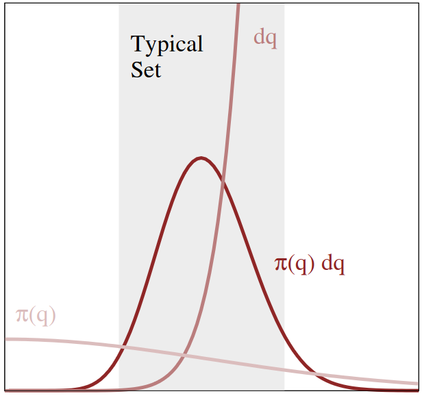

Most of the content here I prepared for giving a talk on Bayesian inference. Some background stuff didn't fit in the (introductory) talk itself, so this is more of a space for me to put the rest.

Below, I will discuss a few things: Firstly how Bayesian inference leads into the need to sample from high-dimensional functions. I'll then discuss some peculiarities of high-dimensional spaces. These will be used when I discuss a few different solution methods, to explain why and when they will work or fail.

# Motivations
## Bayesian inference

Bayes' theorem is most often stated as follows:
$$
P(A | B) = \frac{P(B | A) \cdot P(A)}{P(B)} \quad \text{where} \quad P(B) \neq 0
$$
Which is very simple to show by multiplying both sides by $P(B)$ and using the definitions of conditional probability.

This theorem holds not only for discrete events but also for probability distributions in general. This fact is then used in a setting where $A$ is the value of some parameters $\theta$ that you would like to estimate given the measured values of some set of data points $\mathbf{D}$. It then looks like this:
$$
P(\theta | \mathbf{D}) = \frac{P(\mathbf{D} | \theta) \cdot P( \theta )}{P(\mathbf{D})} \\[12pt]
= \frac{P(\mathbf{D} | \theta) \cdot P( \theta )}{\int P(\mathbf{D} | \theta) d\theta}
$$
Again, using the definition of conditional probability to re-write $P(\mathbf{D})$ as an integral over the entire domain of $\theta$. So far so good. Now you can put in any prior knowledge you have about your parameters into $P(\theta)$ (or make it a constant function if you have none), and put the core of your model in $P(\mathbf{D} | \theta)$, describing how a model with a specifically selected parameter value $\theta$ will generate observations. The last re-write for $P(\mathbf{D})$ in the above formula even saves you from interpreting the almost philosophical question of "what is the probability of my data" by explicitly restricting it only to the model/parameter space you are integrating over.

Note: If you have a limited set of parameter values you are interested in and only care about [comparing their values relative to eachother](https://en.wikipedia.org/wiki/Bayes_factor), the denominator in this equation is simply divided out, so $P(\mathbf{D})$ doesn't have to be calculated at all.

## Dimensionality of $\theta$
The problem comes in when you want to calculate this last integral $\int P(\mathbf{D} | \theta) d\theta$ in the case where you have a large number of parameters. In other words: $\theta$ is a high-dimensional vector. In many situations, there is [no closed-form solution](https://en.wikipedia.org/wiki/Nonelementary_integral). This leaves you with the option of making a numerical approximation.

## Solutions

### Variational Inference
One angle of approach is to approximate the integral with one that is very similar, but simpler to integrate and then solve that one. This is called [variational inference](https://en.wikipedia.org/wiki/Variational_Bayesian_methods), and has a rich theorical background with some ways to get bounds for your approximation. It's computationally a quite efficient method for calculating this integral, but it is not guaranteed to asymptotically converge to the correct value.


### Sampling
The other way is to try and draw samples from the probability distribution $P(\mathbf{D} | \theta)$, and asymptotically approximate it using them. The rest of this post will mostly discuss this avenue. Drawing samples is an interesting method because once you have them, you can do more with them than just calculate this integral: Samples from a probability distribution $\pi(x)$ are in fact a very general way to calculate all expectation values of a quantity $f(x)$ under $\pi(x)$:

$$
\mathbb{E}_{\pi} [ f ] = \int f(x) \pi(x) dx \approx  \frac{1}{N} 
 \sum_{n=1}^{N} f(x_{i})$$

Where $\lbrace x_{i} \rbrace$ is the set of $N$ points sampled from $\pi(x)$. Of course, for this we should be able to evaluate the function $f(x)$ at this set of points, which usually isn't a big deal. This makes it relevant not only for Bayesian inference, but also e.g. solving lattice models in statistical physics and chemistry. 
**The problem at hand now comes down to drawing samples from a general $\pi(\mathbf{x})$.**

# High-Dimensional space
To look at the workings of sampling approaches, it is first interesting to take a closer look at the space in which we're working. High-dimensional spaces have some peculiarities. 

Note firstly that if you want to sample from a distribution in order to approximate the integral above, you shouldn't focus too much on the regions of space $\mathbf{x}$ where $\pi(\mathbf{x})$ is very close to zero. These areas will not contribute much to the end result in the integral. e.g. When trying to sample from a Gaussian centered around 0 with a standard deviation of 1, you probably won't try to draw too many samples from x=999999.

## Volumes & Distances

An interesting thing to note is that in high-dimensional space, there is much more volume *outside* of any given neighbourhood than inside it. This is explained by [Betancourt](https://arxiv.org/pdf/1701.02434.pdf) with the following example:

 \
*Fig: Lattice example to show how dimensionality can reduce the relative volume ([source](https://arxiv.org/pdf/1701.02434))*

In the image above, see how if we take the center 1/3rd of a space and start to increase dimensionality, the relative volume of this part quickly diminishes from 1/3, to 1/9, to 1/27. 

A similar thing happens in the situation where we look at a sphere, centered around 0:

 \
*Fig: Spherical radial volume distribution as a function of dimensionality. ([source](https://arxiv.org/pdf/1701.02434))*

In the image above, the dotted line shows the radius at which there is as much volume of the sphere inside of it, as there is outside. What you can see here is that in higher dimensions, this dotted line moves more and more towards the outside. In very high dimensions, this dotted line is so close to the outside that **most of the volume of this sphere is in a thin 'shell' at the outside**. This happens just because there is so much more space further away from a point than close by. If you wanted to weigh a high-dimensional sphere, you would not even notice if someone had taken the center out.

## Typical Set
This has an interesting consequence for our setting. Let's remember we are looking at probability distributions. Think of a Gaussian-like distribution $\pi$ (without too much loss of generality). We said we should focus mostly on the regions where $\pi$ is large to most effectively sample from it. For a Gaussian, this would be around its center. However, we just discussed how in high dimensions, there is much more space away from any one (center) neighbourhood than inside it. For the n-dimensional sphere it was even negligible! How do we reconcile these observations?
It turns out that the initial observation in this section was perhaps a bit short-sighted. The most important contributions to the integral we want to approximate don't necessarily come from $\mathbf{x}$ with a large $\pi(\mathbf{x})$, they instead come from large $\pi(\mathbf{x}) d\mathbf{x}$! In other words, $\pi$ diminishes further way from the center, however there being just so much more space $d\mathbf{x}$ away from the center, that these two factors at some distance cause a maximum of $\pi(\mathbf{x})d\mathbf{x}$. This is illustrated in the image below:

 \
*Fig: Illustration of how the distribution and the geometry of space combined give rise to a region of interest called the typical set.  ([source](https://arxiv.org/pdf/1701.02434))*

The region where $\pi(\mathbf{x})d\mathbf{x}$ is large is referred to as the *typical set*. For a Gaussian this set forms a narrow ring around the center. The exact size, position and shape of the typical set depends on the distribution and dimensionality, but for many distributions we see a similar end result: A set, comprising only a tiny part of the total space, not necessarily including the mode of the distribution. 

## Consequences for sampling

It's good to remember that when we want to effectively sample from a distribution in high dimensions, practically all of the probability mass will be concentrated in the typical set. Meaning that if we sample a lot of points outside of this space, their contribution will be negligible and thus we are just wasting computations. *An important goal of a good sampling approach will then be to find the typical set and thoroughly explore it*.

# Approaches

## Uniform sampling
Generating uniformly random numbers is actually a relatively simple case that has been studied for ages in the context of computer science, and for which any self-respecting scripting/programming language will have a standard library implementation. See the [linear congruential generator](https://en.wikipedia.org/wiki/Linear_congruential_generator) for a simple example. For an $N$-dimensional point, simply sample $N$ one-dimensional points and concatenate them into a vector.

Of course, this only works for our problem when $\pi(x)$ is a constant: not the most generic case. However we will see that this is a major building block for the rest of the approaches.

As a side-note, there are some specific probability distributions we can sample by simply transforming uniform random numbers $z \in [0,1]$, like scaling and shifting to get a uniform number $y = (z+a)(b-a) \in [a,b]$, or using the [Box-Muller transform](https://en.wikipedia.org/wiki/Box%E2%80%93Muller_transform) to sample from a Gaussian.

## Rejection Sampling
Armed with uniform samples, and a reasonable idea for what the maximum of the distribution $\pi_{max}$ is you want to integrate, rejection sampling is a method that generates a lot of uniform random sample proposals $\mathbf{z}_i$, and for each of these of these generates another uniform random number $a_i \in [0, \pi_{max}]$. If $a_i < \pi(\mathbf{z}_i)$, the point is added to the set of samples $\lbrace x_i \rbrace$. If not, it is instead discarded. The method is fairly simple when looking at it visually:

 \
*Fig: Example of rejection sampling. Many uniformly random points are generated within this 2D box, but only the blue ones below the function (black line) are kept. The red ones are discarded. ([source](https://www.jarad.me/teaching/2013/10/03/rejection-sampling))* 

I won't give proof here that the sampled points come from the function $\pi(x)$, but it should be intuitively clear that many points $x_i$ are generated where the function is high, and very little points where the function is small, that this scales linearly with the function value.

Okay, so this solves our problem, right? Sample from the function using this method, and approximate any integral or expectation value of this probability distribution! Unfortunately, there are a few drawbacks to this method. Firstly, you should have a good idea of the function maximum, and err towards a larger number to keep its statistical validity intact. Secondly, the method can be very inefficient, as all of the points you reject are essentially just wasted effort. Already in the image above you can see a lot more red points than blue ones, and this is just for a smooth one-dimensional function with a tight bound on $\pi_{max}$. This gets worse the more the mass of the probability distribution is concentrated in small 'spikes'.

Taking into account what we now know about the typical set and concentration of measure in high dimensions, this approach seems almost hilariously wasteful. Practically all of the points will be rejected, so in a high-dimensional setting it's mostly good for generating extra CO2 with your computer..

## Importance sampling
A more scalable approach is [importance sampling](https://en.wikipedia.org/wiki/Importance_sampling). This method actually (partly) takes into account the information you have about the function you're trying to sample from. What you do with this method is sample from a probability distribution that is similar, but much simpler. Think for example of using a Gaussian distribution as an approximation, where we have methods of cheaply sampling from it.

 \
*Fig: Example of importance sampling. The (red) distribution $p(z)$ is approximated by the simpler (green) $q(z)$ ([source](https://cedar.buffalo.edu/~srihari/CSE676/17.2%20Importance%20Sampling.pdf))* 

Of course, doing this in a naive manner would give you the wrong result! We need some way of correcting the samples from $q$ to make them statistically come from $p$ instead. Luckily there is a very simple way of doing this, simply weigh each sample $\mathbf{x_i}$ by a factor $w_i = \frac{p(\mathbf{x_i})}{q(\mathbf{x_i})}$, making the sample more important if $p$ is larger than $q$ at that point, and vice versa. The (simple) proof for this can be found in the source link of the image above.

Now, if you have a vague idea of what your function should look like, you can simply slap a (multimodal) Gaussian distribution over it and let it rip. Of course, for a general function again you may not know what it looks like, or it may have some local spikes. The more your $q(z)$ deviates from the actual $p(z)$, the more samples you need to still approximate it well. So this method allows you some more leeway in scaling up in dimensionality as long as you have knowledge about the distribution. Not exactly yet where we want to end up, so let's continue.

## Markov-Chain Monte Carlo methods
Markov-Chain Monte Carlo (MCMC) methods are all based on generating a chain of points, where each next point in the chain is based on the last one (hence the Markov Chain). Of course, subsequent points in a chain like this are highly correlated, so only every $n$-th point is kept and the rest are discarded to prevent correlated samples. The initial points in the chain are discarded to allow you to start anywhere you like and give the algorithms a few steps to converge to the distribution (this is the so-called *burn-in* period of the chain).

 \
*Fig: Example of MCMC sampling. A chain of points is generated from an initial point. Each next point is stochastically dependent only on the previous one. ([source](https://www.researchgate.net/figure/Markov-chain-Monte-Carlo-sampling-using-random-walk_fig1_331494053))* 

The methods below only differ in the way they generate the next point in the chain. Of course it's important to do this in a way such that the distribution of points in the chain eventually converges to the one you want to sample from.

To deal with multimodal distributions, a few of these chains are started in parallel with different initial positions. There is still no guarantee that this will make it explore all modes, but at least this improves the odds.

### Gibbs sampling
With Gibbs sampling, you try to break down a high-dimensional sampling problem into a series of one-dimensional ones. At each point $\mathbf{x}^{cur}$ in the chain, you generate the next $\mathbf{x}^{next}$ as follows (denoting with $x_i$ the $i$-th component of the vector $\mathbf{x}$):
$$
x_0^{next} = P(x_0 | x_1^{cur}, x_2^{cur}, .., x_N^{cur}) \newline
x_i^{next} = P(x_i | x_0^{next}, .., x_{i-1}^{next}, x_{i+1}^{cur}, .., x_N^{cur})
$$

In other words, you sample $\mathbf{x}^{next}$ component by component. For each component you make it conditional on the components you already have, and using the components of $\mathbf{x}^{cur}$ otherwise.

This method is avantageous if evaluating the conditional distribution is easy compared to the entire one (e.g. in the case of [Bayesian networks](https://en.wikipedia.org/wiki/Bayesian_network)) or when you are interested in a subset of variables specifically.

### Metropolis-Hastings
For the Metropolis-Hastings method, the next point in the chain is generated by using a reasonable distribution (e.g. a Gaussian) centered on the current point to generate a new proposal (by sampling from it) to move towards. If the function at this point has a higher value, move there. If not, only move there with probability $p_{\text{accept}} = \frac{f(x_{\text{new}})}{f(x_{\text{old}})}$.

This approach is both simple to implement (probably about 5 lines of code), flexible and effective, and so historically it has been quite popular. The disadvantage in high dimensions is that typically sampling an (isotropic) Gaussian explores in all directions equally. Remember that the typical set in high-dimensions is only a very small part of the space. Given that you are currently somewhere in the typical set, most directions that you move in will actually take you outside of the typical set, so most steps get rejected. This will, again, make it less effective in higher dimensions.

```python
def metropolis_hastings_step(x_curr, pi, proposal_dist):
    accept_proposal = False
    while not accept_proposal:
        x_prop = x_curr + proposal_dist.sample()
        accept_proposal = pi(x_prop)/pi(x_curr) > uniform_random([0,1])
    return x_prop
```
*Python code for a MH-step*

A clear way to improve this is by not using the same proposal distribution everywhere throughout the sampling process, but somehow adapting the proposal to the shape of the function you're sampling from. The goal is then to keep following the directions of high probability to stay in the typical set and sample efficiently. This is the way the best current methods are doing it! Of course, the trick is doing it in a way that's both efficient to calculate and converges to the statistically correct result.

### Hamiltonian Monte Carlo
The Hamiltonian Monte Carlo (HMC) method does it by simulating [Hamiltonian particle dynamics](https://en.wikipedia.org/wiki/Hamiltonian_mechanics), which is a reformulation of classical mechanics in physics. 

When at a specific point, a certain situation is simulated: That of a particle with a random velocity and its potential energy given by the function that you want to integrate.

In simpler terms: think of a pinball rolling through a hilly landscape, where the shape of that landscape is $-f(x)$. The pinball starts at your current point where you give it a nudge in a random direction. Intuitively, this means the pinball will tend to go towards the high-probability areas (valleys) and thus the typical set, but because of its random speed and direction, will still roll around a bit and not just stay in the closest local minimum.

To actually simulate the dynamics with Hamiltons equations, we have to approximate the function gradients by [leapfrog integration](https://en.wikipedia.org/wiki/Leapfrog_integration). For this we simulate it with some discrete steps which includes sampling the function at a few locations for each step. This means that taking a single step is more costly than in the other methods. However, each step gives us a lot more too: Firstly the proposals we generate are based on the shape of the posterior function, so can incorporate much more information to make a good step proposal, staying within the typical set. Secondly because of this whole [position/velocity dynamics simulation](https://en.wikipedia.org/wiki/Liouville%27s_theorem_(Hamiltonian)), the samples are not correlated in position as they would usually be. These things result in the acceptance probability of a step being very high and a very efficient exploration of the typical set.

### No U-Turn Sampler
The [No U-Turn Sampler (NUTS)](https://arxiv.org/abs/1111.4246) is a specific HMC method that recognizes when simulating the particle dynamics result in taking a U-Turn (meaning, the particle returns to a previously visited state). At this point, it stops simulating dynamics and samples a new velocity. This makes sense to do because the intuition is that if a U-Turn occurs, you have likely explored most of the space that the particle dynamics could have reached. This is an even more efficient approach than HMC in general, and the best 'default' algorithm to use.

# Software
The most used packages for Bayesian modelling that implement all the above-mentioned algorithms (assuming you are working in Python) are:
* [STAN](https://mc-stan.org/) is a platform that does statistical computation, and has bindings to a couple different languages (e.g. Python that allow you to call it from them. See [PySTAN](https://pystan.readthedocs.io/en/latest/) for an example on how this looks like. Personally I dislike having to put my entire model specification in a big docstring, but I can imagine someone else has written something to avoid this.
* [PyMC](https://www.pymc.io/welcome.html) is a probabilistic programming language for Python, and the one I've used more myself. See the [example notebooks](https://www.pymc.io/projects/examples/en/latest/gallery.html) for how it's used. To me, it feels more natural and better integrated with Python. If you want to quickly get going with these types of models, I recommend to use this one. When using tutorials etc. take care to use the ones for PyMC4, not PyMC3.
# Take-Home
Hopefully it's clear how (at least) Bayesian inference results in the need to sample from high-dimensional spaces, and why these spaces can be a bit unintuitive. We have an overview of the most important algorithms to tackle this problem, as well as their relative strengths. This should give a lot more intuition when working with sampling algorithms in situations where you have to debug why something is not (or only very slowly) converging.

So in a nutshell, when to pick which approach:
* Use VI for very large datasets and/or very high dimensionality. It is faster, but less accurate.
* Use MCMC otherwise, especially where there is a large need for optimal fit and accuracy. It is slower, yet will converge to the exact result. In general NUTS is the default algorithm in this space for a reason, so go for this one.

# Further Reading
* [An introduction to Variational Inference](https://arxiv.org/abs/2108.13083) if you want to know more about this approach.
* [A conceptual introduction to Hamiltonian Monte Carlo](https://arxiv.org/abs/1701.02434). Beware: 60 pages although not too dense to read. Covers a lot of the topics above from a theoretical standpoint.
* Get going with [PyMC](https://www.pymc.io/welcome.html). The beginner guides are quite good to get started with Bayesian modeling from a practical perspective.
* Great [visualizations with explanations](https://arogozhnikov.github.io/2016/12/19/markov_chain_monte_carlo.html) of Metropolis-Hastings and Hamiltonian Monte Carlo
* Methods for generating random samples from [specific probability distributions](https://en.wikipedia.org/wiki/Non-uniform_random_variate_generation)
* Explanation [from a physics perspective](http://arogozhnikov.github.io/2016/12/19/markov_chain_monte_carlo.html) of MCMC methods
