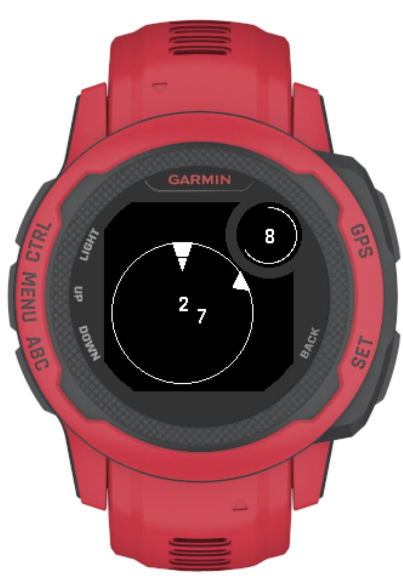

This is a follow-up to the [Impractical Time Telling]( "Impractical Time Telling") post.

## Impractical Time Telling II: The Practicalities

The plan was to do this in some downtime over the Christmas holidays, but the stars already aligned a few weeks ago. I found a Garmin Instinct 2S smartwatch in the house, and Garmin actually has a good setup ([called Connect IQ](https://developer.garmin.com/connect-iq/overview/)) for developers to create their own apps, watchfaces, et cetera. 

## Garmin development

To develop a watchface, you should install the SDK on your machine, and install packages for the specific devices that you want to emulate. It's highly recommended to then also install a PyCharm or VSCode extension for 'Monkey C'. From your IDE you can then easily start an emulator for a device to test your software during development. [Monkey C](https://developer.garmin.com/connect-iq/monkey-c/) is Garmins own object-oriented language that should make it easy to use for app development.

## My experience & Peculiarities

The SDK comes with some very basic examples in it, but I had to search for a while to get my bearings in the beginning. Where in a project to start adding your actual logic, what should get defined where, and what gets executed when. Once I got a hang of that and managed to draw a circle onto the screen, the sailing was fairly smooth. Monkey C is a simple language to just start programming in and figure it out on the go. I spent an embarrassing amount of time trying to draw the right colors, before I realized my watch model only supports black and white...

Another complication was that the watchface was not simply round or square, but was round with a little circle in the top right with a rim around it (see the picture down below at the end of this post for a visual). The SDK did not really have any native tools to handle this (e.g. different objects for each circle, or preventing me from drawing to pixels underneath the rim), and had only a simple cartesian coordinate grid for pixels to draw onto, so the positioning of everything had to be felt out and shifted back and forth by a few pixels a couple of times.

The final peculiarity of Garmin watches is that they have low-power and high-power modes. In low-power mode, the screen only gets updated once a minute. In high-power mode it happens every second. High-power mode can be activated by the user by rotating their wrist back and forth a bit, shaking the watch slightly. After a few (by default I believe 10) seconds, it falls back to low-power.

## The Solution

To summarize, we had the following constraints on this watch that would require a slight re-design of the watchface:
1. Only black and white screen, so no colors for each hand and overlapping hands with transparency.
2. Not a simple round watchface
3. The default low-power mode updating only once every minute, while high-power mode can be activated deliberately for a few seconds at a time. So the seconds-hand should not be shown at all times.

To solve these, I implemented the following:
1. The main watch face is still a round polar plot, but shrunk toward the bottom-left so that it does not overlap with the small circle in the top right
2. The small circle in the top right can be used to show the hours, both in simple text and as the arc of a circle going around the edge of it.
3. The main watch face will show the prime-decomposed minutes-hand in a polar plot during low-power mode
4. The main watch face will show the prime-decomposed seconds-hand during high-power mode.

In this way, we can still read the hours and minutes at all times, and can shake our wrist to display the funky seconds hand jumping around.

An alternative would be showing hours in low-power on the main one, and minutes in high-power mode. The top right small circle can then be used for another widget like showing the heart-rate or something. I didn't choose to do this as the seconds-hand jumping around is kind of the main selling point of it. However with the current code, it should be quite easy to make these changes in the watchface settings and only a small change in the codebase to get this.

The finished implementation showing the time at 08:28 is shown below:

If you want to see the code, see the [Github repo](https://github.com/jbukala/prime_time) (Specifically in the *prime_time* subfolder). I will also see if I can get it into the Garmin app store without too much hassle as a finishing touch.
