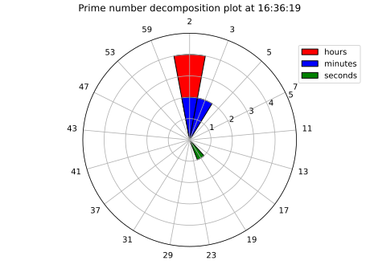
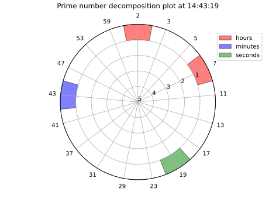
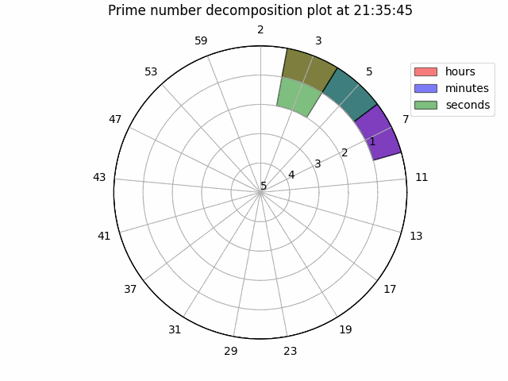
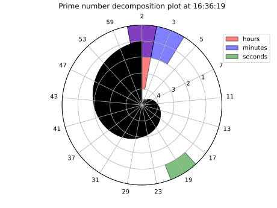

## Impractical Time Telling

You know how sometimes problems are just completely *solved* and thus boring? Like telling the time: We used to have sundials, now we have quartz watches, digital clocks... *Yawn*. A while ago I got a [watch that was quite funky](https://projectswatches.com/cdn/shop/files/bauhausblackhero.jpg?v=1688088927&width=800), although a bit of a challenge to read.

It got me thinking, why not *create* a nice problem to solve by creating an impractical representation of the current time and make a watch face that can display it as reasonably as possible?

All the stuff discussed below can be found in my [Github repo](https://github.com/jbukala/prime_time).

## Prime time

Of course, what other choice could you make but [prime decomposing](https://en.wikipedia.org/wiki/Integer_factorization) each number. That way you can name your Github repository *prime-time*, it's got a nice ring to it. Its impractical enough, and has enough mathematical depth to try and exploit while representing it on a watch face. The idea is that we take each of the 3 separate numbers in the 24h digital clock (*HH:MM:SS*), and factorize them into prime numbers, so $24 = 2^3 \cdot 3^1$. Simple enough so far.

## Representing them
The [fundamental theorem of arithmetic](https://en.wikipedia.org/wiki/Fundamental_theorem_of_arithmetic) says that this decomposition is *unique*. This is nice, as it means we don't have to make any choices during this process and each numbers' prime representation is distinct. Something that will be useful to us is thinking of it as an integer-valued vector in the basis of prime numbers, where each basis vector $e_i$ is the *i*-th prime number (ordered from small to large). Then in the example from before we have $24 = 2^3 \cdot 3^1 = (3,1,0,0,...)$. In general:
$$\prod_{i=0}^{\infty} e_i^{n_i} = (e_0^{n_0}, e_1^{n_1}, ..., e_k^{n_k}, ...)$$

## Constraining the problem

In general calculating this factorization is NP-hard, and you may have noticed the infinite-dimensional vector in the previous equation. Now we can bring in the fact that we're actually just using it to tell time: All of the numbers we factorize and represent are between 1 and 60. This means that calculating the factorization will be fast and we can cache the resulting vectors somewhere. You only need the first 17 primes to represent all these numbers, so our infinite-dimensional vector reduces to a 17-dimensional one. Much better!

Next to this, we have to consider that watch faces are mostly round. This means that simply making a bar chart of each number is not going to work so well. Lets go for a polar plot instead.

## First steps

With our vector representation and the idea of a polar plot, we can now divide the circle up into 17 equal '*pizza slices*', where each one can represent a prime number. Each component of the vector can then be plotted by starting from the center and filling up the pizza slice. More of this prime number means a more filled slice. We have 3 numbers to represent so we'll just plot each one in its own color. 

Doing this gives us the following:

Where we can see that $16 = 2^4$, $36 = 2^2 \cdot 3^2$ and $19 = 19^1$.\
Cool! This is already technically usable, but has some obvious improvements:
1. Firstly we should explicitly constrain the range of the radius to be $[0,5]$ for consistency, as the largest amount of factors for a single prime is in $2^5 = 32$.
2. Most prime numbers will actually mostly have 1 or 2 factors. In the current setup that means the centre of the circle will be very 'busy', and is very small anyways. Most of the surface of our circle is on the outside. We should flip the radius axis, and actually start plotting from the outside of the circle inwards, to use the available space better.
3. Where the polar plots of the different numbers overlap, information can get lost. Let's just increase the transparancy of the plots for now to sort of deal with this.

## Current status

Making these changes, we arrive at the plot below:

To appreciate its full funky-ness, here is a GIF of the watch running for 10 seconds:

## Next steps

The current implementation is a very simple one in Python with matplotlib. A nice next step would be to actually implement this for a smart watch of some sorts.

Something that is also already clear that even in this polar representation, there is a large part of the plot that is not being used. As mentioned already, most primes only need to be able to represent 1 or 2 factors (e.g. $53^4 = 7890481$ will never get used). For our watchface this means there is a sort of outward spiral-shaped part of the plot that will always be empty, looking roughly like the black area below:

This is actually not a disaster: It gives some extra free space to dump gadgets like your heart rate, the date, etc.

Finally - I don't expect the *seconds*-hand to be of much practical use. Not sure how fast you can multiply prime numbers together in your head, although it *does* make it look extra funky!