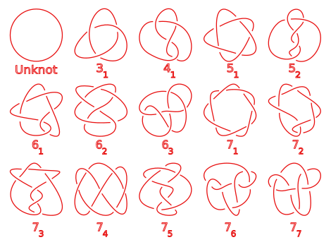
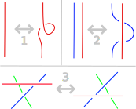

## Playing with strings

Knot theory is one of those topics where you start out asking a very simple and natural question, follow a thread (*hehe*), then look around you and realize you're knee-deep in at least 5 fields of math.

The central topic of interest within knot theory is - you guessed it - knots. A **knot** in this context can be thought of as just a piece of string that is attached together at the ends. So if you feel like it, go and grab a piece of string lying around your house, or cut open a rubber band or whatever. It's literally all you need.

**Disclaimer**: I'm not going to write down any *proofs* in here. I'll just mention that it is proven and then you can go down to the lecture series videos if you are interested in them. Also, I'm just learning to work with Inkscape to draw graphics whenever I can't find them on Wikipedia, so cut me some slack in that department.

The simplest possible knot we can look at is made when we take our piece of string and just tie the ends together so that it makes a clean circle. This is such a simple knot it is barely even a knot, right? This is why it's called the **un-knot**. It's depicted on the left in the figure below:

\
*Fig: The unknot in 2 different forms. Note that we are taking an object existing in 3D space and drawing a projection of it in a 2D image: The line being invisible for a little bit denotes the fact that it crosses underneath itself there*

But wait a minute - what about the knot on the right? If we would grab that string by the top bit and rotate that around, we would get the unknot again. Because this is possible, we say that they are both the same knot. We are not really interested in those differences that can be removed through actions like these (called [ambient isotopies](https://en.wikipedia.org/wiki/Ambient_isotopy)). This means that the unknot can take very [complicated forms](https://en.wikipedia.org/wiki/Unknot#Examples).

But how do we know if a knot is the unknot when all we see is a complicated diagram? Should we simply get a piece of string and try to pull from all directions until we get the unknot back? What if we don't succeed? Does that mean it's not actually the unknot, or that we just didn't try for long enough?

It turns out that there exist many different knots. The system of writing them down considers each knot in their simplest form: having the minimum amount of *crossings* (the times that the diagram crosses overneath itself). If we call this minimum crossing number $C$, a knot is referred to as $C_i$, where $i$ is simply a number allocated to it in a knot-encyclopedia of sorts, but not inherently meaningful.

\
*Fig: The table of prime knots up to 7 crossings with Alexander-Briggs notation ([Source](https://en.wikipedia.org/wiki/File:Knot_table.svg))*

The simplest form of a knot is called a [prime knot](https://en.wikipedia.org/wiki/Prime_knot). Yes, that word carries a lot of baggage with it, and no it doesn't just talk the talk. Prime knots are not the result of composing together other simpler knots, and all knots can be uniquely constructed by connecting prime knots together. They are the equivalent of prime numbers within number theory.

What I didn't say yet is how we know we know that these are all different knots, and how we know that these are all knots with up to 7 crossings. This is a really hard question. Finding out if two knots are equivalent to eachother is actually the **central question of knot theory**, and it leads to some interesting places.

## De-composing movements

As it turns out, there are actually 3 types of ways you can deform a knot to make it change its appearance, without altering what knot it is. These ways are called the [Reidemeister moves](https://en.wikipedia.org/wiki/Reidemeister_move). Each one looks at a section of the knot, and what you can do with it:
\
*Fig: The 3 Reidemeister moves*

The moves are as follows:
1. Taking a part of the knot, and twisting a bit of it into a simple new loop crossing underneath itself
2. Having two separate parts of the knot, and pulling a small bit of the one underneath the other (pulling blue underneath red in the image)
3. Having two sections crossing over eachother (blue and green in the image), and a third section passing over each of them (red), you can move that third section completely over the initial crossing (move red downwards)

This means that any two of the same knots can be transformed into eachother through a sequence of the correct Reidemeister moves. You probably see quickly for the two depictions of the un-knot pictured above that it is just one step: move 1. However, for larger knots with many crossings, even this quickly becomes unviable. Consider also the knots $3_1$ and $4_1$ in the diagram above: Knowing the Reidemeister moves doesn't immediately show you that it is impossible to transform one into the other through them. Perhaps there is an extremely long sequence of moves that takes you from one to the other. Proving the negative requires an extra ingredient: **invariants**.

## Knot Invariants

Much of knot theory consists of mapping a knot to some number, which is not dependent on the way that it is folded. To prove that the quantity is invariant to all possible transformations, we can use the Reidemeister moves. If we prove that for each of the Reidemeister moves the output number stays constant, we know it's an invariant.

### Colorability

As a simple example of this, we can define *tri-colorability*. This is a binary outcome which says if the knot $K$ is tri-colorable or not. Taking a 2D knot diagram, we should try to color each line segment (so stopping when the line does *under* a crossing) according to the following rules:
1. At least 2 different colors have to be used
2. At each crossing, the lines have to be either all the same color, or all different 

If this is possible, the knot is called tri-colorable. An example is given below:

\
*Fig: A Granny Knot which has been tri-colored ([source](https://en.wikipedia.org/wiki/Tricolorability#/media/File:TricoloredGrannyKnot.svg))*

The Reidemeister moves [don't affect this binary tri-colorability invariant](https://en.wikipedia.org/wiki/Tricolorability#Isotopy_invariant). So now we know that **if one knot is tri-colorable while the other is not, they *must* be different knots**. To flex our newfound knowledge, let's refer back to the table of prime knots and try to find the tri-colorability of both the un-knot and $3_1$. The un-knot is not tri-colorable, as we fail immediately at rule #1. The knot $3_1$ is the simplest knot to tri-color. This means we've proven the difference of the first 2 knots in the diagram! Unfortunately this invariant is rather weak: As it's only a binary property, it can only ever divide all possible knots into two groups, without any way to discern betwwn knots inside each group. The granny knot pictured above is also tri-colorable, but we know it's not $3_1$.

The solution is clear: Construct more invariants (preferably more discerning than this one) and start throwing them at our collection of knots to find if they can discern between different ones.

### Alexander Polynomial

### Conway Polynomial

### Genus

## Applications

## References

* A really great [lecture series on knot theory](https://www.youtube.com/watch?v=EBWP1POPc2A&list=PLOROtRhtegr4c1H1JaWN1f6J_q1HdWZOY) by Dr. Bosman at Andrews University. The Youtube video playlist starts with a nice entry level explanation to the central topic, but goes very in depth and the lecturer is excellent.
